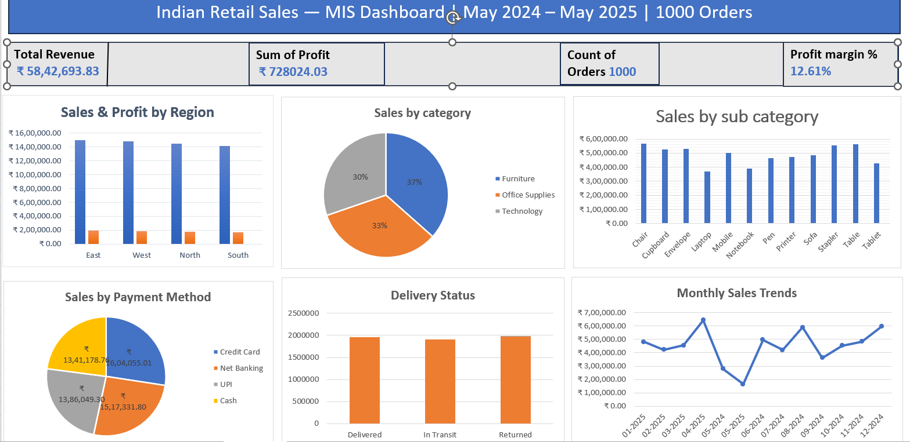

## Dashboard Preview

Excel  Dashboard analyzing 1,000 retail orders with KPIs, pivot tables, and business insights

## Topics:
- excel
- data-analysis
- mis-dashboard
- pivot-table
- business-analysis
- kpi-dashboard

---

## Project Overview

Excel-based  dashboard analyzing 1,000 retail orders to track revenue, profit, returns, and regional performance.

| Detail | Info |
|--------|------|
| Tool | Microsoft Excel |
| Dataset | 1,000 orders · 14 columns |
| Period | May 2024 – May 2025 |
| Regions | East · West · North · South |
| Categories | Furniture · Office Supplies · Technology |

---

## What Was Done

- Cleaned dataset (duplicates, missing values, formatting issues)
- Created helper columns for time-based and profitability analysis
- Built 6 pivot tables for business reporting
- Designed an interactive dashboard with KPIs and slicers

---

## Dashboard Features

- KPI tracking: Revenue, Profit, Orders, Avg Order Value, Profit Margin %
- 6 charts covering region, category, sub-category, payment, delivery, and trends
- Interactive slicers (Region, Year) connected across all visuals
- Clean layout with consistent formatting and business-focused design

---

## Key Insights

- High return rate (33.3%) indicates potential issues in delivery or product quality
- East region contributes highest revenue (25.6%), making it a key focus area
- Furniture leads sales but requires margin monitoring
- March 2025 shows peak performance, likely due to seasonal demand
- Credit Card is the dominant payment method (29.2%)
- South region has lowest profitability (11.87%), indicating cost or pricing issues

---

## Business Use Case

This dashboard helps management to:
- Monitor sales and profit performance across regions
- Identify high-return problem areas
- Track category-level contribution
- Support decisions on pricing, logistics, and promotions

---

## Dataset

| Field | Detail |
|-------|--------|
| Source | Kaggle — Indian Retail Sales Dataset |
| Rows | 1,000 |
| Columns | 14 |

---

## Files

| File | Description |
|------|-------------|
| Retail-Sales--Dashboard-Excel.xlsx | Main Excel dashboard |
| dashboard.png | Dashboard preview |
| README.md | Project documentation |

---

## Skills

`Excel` `Pivot Tables` `XLOOKUP` `SUMIFS` `Data Cleaning`
`MIS Reporting` `Dashboarding` `KPI Analysis` `Business Insights`

---

## Conclusion

This project demonstrates how Excel can be used to build a structured MIS dashboard for tracking sales performance, profitability, and operational issues. The analysis highlights key problem areas such as high return rates and regional profit gaps, enabling data-driven business decisions.

SINGIREDDY SAIKIRAN REDDY
[saikiranr717@gmail.com](url)
